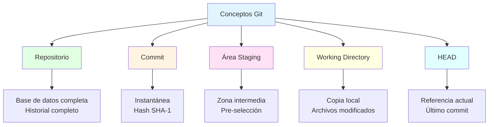
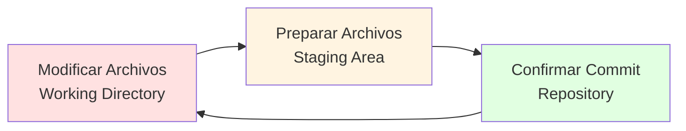
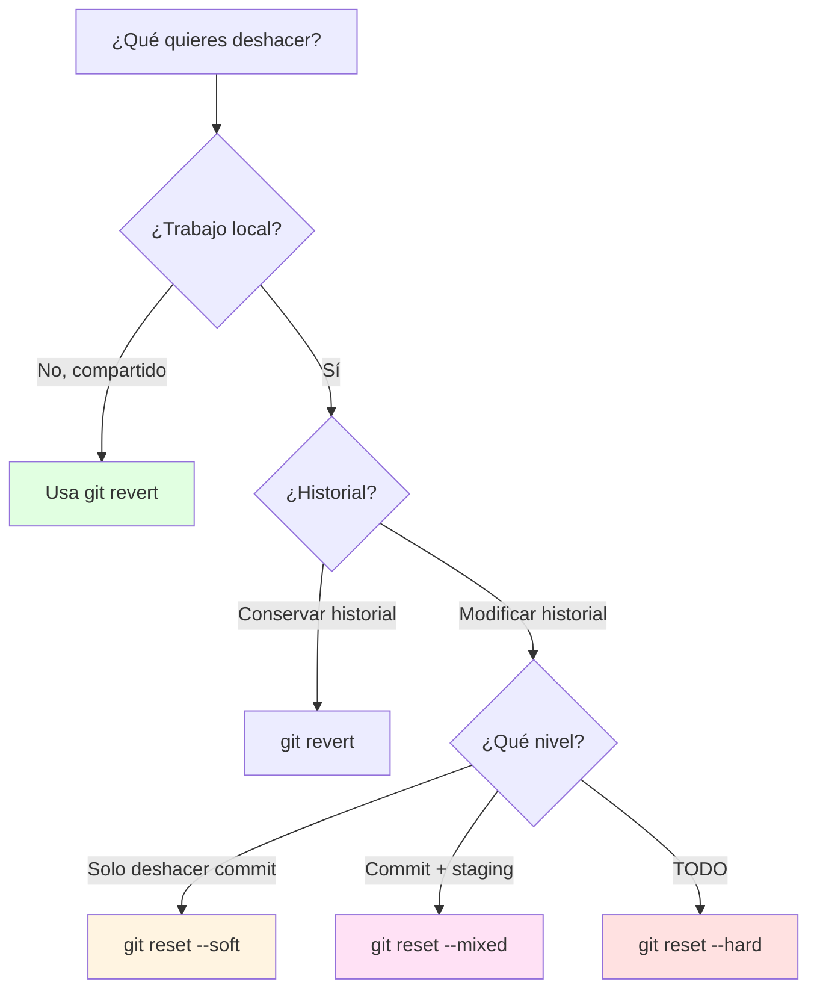
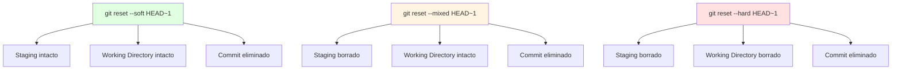

- [1. Git Inicial](#1-git-inicial)
  - [1.1. Introducción a Git](#11-introducción-a-git)
    - [Git vs Sistemas Centralizados](#git-vs-sistemas-centralizados)
  - [1.2. Conceptos Clave en Git](#12-conceptos-clave-en-git)
    - [Repositorio (Repository)](#repositorio-repository)
    - [Commit (Confirmación)](#commit-confirmación)
    - [Área de Preparación (Staging Area)](#área-de-preparación-staging-area)
    - [Directorio de Trabajo (Working Directory)](#directorio-de-trabajo-working-directory)
    - [HEAD](#head)
  - [1.3. Ciclo de Vida de los Archivos en Git](#13-ciclo-de-vida-de-los-archivos-en-git)
    - [Los tres estados de Git](#los-tres-estados-de-git)
  - [1.4. Comandos Git Esenciales](#14-comandos-git-esenciales)
    - [Configuración Inicial](#configuración-inicial)
    - [Creación y Clonación de Repositorios](#creación-y-clonación-de-repositorios)
    - [Gestión de Cambios](#gestión-de-cambios)
    - [Commit](#commit)
    - [Diff](#diff)
    - [Historial](#historial)
    - [Deshacer Cambios](#deshacer-cambios)
      - [git restore: Deshacer cambios locales](#git-restore-deshacer-cambios-locales)
      - [git revert: Crear commit que deshace](#git-revert-crear-commit-que-deshace)
      - [git reset: Mover el puntero HEAD](#git-reset-mover-el-puntero-head)
      - [Trucos: Eliminar el Último Commit](#trucos-eliminar-el-último-commit)
      - [git reflog: Tu salvavidas](#git-reflog-tu-salvavidas)
      - [git commit --amend: Modificar el último commit](#git-commit---amend-modificar-el-último-commit)
      - [Tabla Comparativa: ¿Cuándo usar cada comando?](#tabla-comparativa-cuándo-usar-cada-comando)
    - [Eliminar Archivos](#eliminar-archivos)
    - [Ignorar Archivos](#ignorar-archivos)
    - [Etiquetado (Tags)](#etiquetado-tags)
  - [1.5. Guardar Cambios Temporales](#15-guardar-cambios-temporales)
  - [1.6. Resumen de Comandos Básicos](#16-resumen-de-comandos-básicos)


# 1. Git Inicial

El **control de versiones** es un sistema que registra los cambios realizados en un archivo o conjunto de archivos a lo largo del tiempo. Permite recuperar versiones específicas, rastrear la evolución del software y coordinar el trabajo en equipo.

> **💡 Analogía:** El control de versiones es como un "guardar partida" en un videojuego. Si cometes un error, puedes volver a una partida anterior. Pero en lugar de una partida, tienes miles.

> 📝 **Nota del Profesor:** El control de versiones es la habilidad más importante que deben dominar. Es su "carnet de conducir" profesional.

## 1.1. Introducción a Git

**Git** es un sistema de control de versiones distribuido, diseñado por Linus Torvalds en 2005 para gestionar el desarrollo del núcleo Linux.

> **💡 Dato histórico:** Linus Torvalds desarrolló Git porque el sistema anterior (BitKeeper) dejó de ser gratuito para el proyecto Linux. Necesitaba algo rápido, eficiente y distribuido.

### Git vs Sistemas Centralizados

| Aspecto | Git (Distribuido) | SVN (Centralizado) |
|---------|------------------|-------------------|
| **Copias** | Cada desarrollador tiene TODO el historial | Solo tiene la última versión |
| **Trabajo sin conexión** | ✅ Completo | ❌ Limitado |
| **Velocidad** | Rápido (local) | Más lento (servidor) |
| **Integridad** | SHA-1 (40 caracteres) | Checksum simple |

> **💡 Ventaja distribuida:** Si el servidor central cae, todos los desarrolladores pueden seguir trabajando porque tienen una copia completa.

## 1.2. Conceptos Clave en Git



### Repositorio (Repository)

Es el corazón del proyecto. Donde se almacenan todos los datos actualizados y el historial completo.

> **💡 Analogía:** El repositorio es como una caja fuerte donde guardas todas las versiones organizadas y comprimidas.

> 📝 **Dato técnico:** El directorio `.git` contiene toda la información. Si lo borras, pierdes el historial.

### Commit (Confirmación)

Un `commit` es un punto de control. Es una "instantánea" del proyecto en un momento específico.

> **📝 Anatomía de un commit:**
> ```
> commit 7cff591a2b3c4d5e6f7a8b9c0d1e2f3a4b5c6d7e
> Author: José Luis González <joseluis@email.com>
> Date:   Thu Jan 8 10:00:00 2025 +0100
>     Añadida funcionalidad de login
> ```

> 💡 **El hash SHA-1** es como la huella dactilar del commit. Dos commits idénticos tendrían el mismo hash. Garantiza la integridad del historial.

### Área de Preparación (Staging Area)

Zona intermedia donde se seleccionan los cambios que se incluirán en el próximo `commit`.

> **💡 Analogía del fotógrafo:** Es como preparar la escena antes de tomar una foto. Decides qué incluir, cómo encuadrar... y cuando todo está listo, "disparas" (haces el commit).

> 📝 **Error común:** Muchos principiantes hacen `git add .` y luego se arrepienten. Pueden usar `git reset` para quitar archivos del staging sin perder cambios.

### Directorio de Trabajo (Working Directory)

Es la copia de los archivos del proyecto en tu máquina local. Aquí realizas las modificaciones directamente.

> **📝 Estados de un archivo:**
> - **No rastreado (Untracked):** Nuevo archivo, Git no lo conoce
> - **Modificado (Modified):** Cambiaste el archivo, no está preparado
> - **Preparado (Staged):** Listo para el próximo commit
> - **Commiteado (Committed):** Guardado en el repositorio

### HEAD

Es un puntero a la referencia de rama actual, que a su vez es un puntero al último `commit`.

> **💡 HEAD en acción:**
> ```
> HEAD → main → commit más reciente
> ```

> 📝 **Concepto:** HEAD es tu "dedo señalando" el commit actual. Cuando avanzas, tu dedo se mueve al siguiente commit.

## 1.3. Ciclo de Vida de los Archivos en Git



1. **Modificar archivos**: Realizas cambios en tu **directorio de trabajo**
2. **Preparar archivos**: Añades los cambios al **área de preparación**
3. **Confirmar cambios**: Realizas un `commit`, guardando la instantánea permanentemente

### Los tres estados de Git

| Estado | Descripción |
|--------|-------------|
| **Confirmado (Committed)** | Los datos están almacenados en tu base de datos local |
| **Modificado (Modified)** | Has modificado un archivo, pero aún no lo has preparado |
| **Preparado (Staged)** | Has marcado un archivo modificado para el próximo commit |

## 1.4. Comandos Git Esenciales

### Configuración Inicial

```bash
# Configurar nombre y email (obligatorio)
git config --global user.name "Tu Nombre"
git config --global user.email "tu.email@ejemplo.com"

# Configurar editor por defecto
git config --global core.editor "code --wait"  # VS Code
git config --global core.editor "vim"          # Vim

# Activar coloreado de la salida
git config --global color.ui auto

# Ver la configuración actual
git config --list
git config user.name    # Ver solo el nombre
```

> 📝 **Configuración por proyecto:** Sin `--global`, la configuración solo aplica al proyecto actual.

### Creación y Clonación de Repositorios

```bash
# Inicializar un nuevo repositorio
mkdir mi-proyecto
cd mi-proyecto
git init
# Salida: Initialized empty Git repository in /ruta/a/mi-proyecto/.git/

# Ver el directorio .git (oculto)
ls -la .git
```

> 💡 **El directorio .git** es el "corazón" de Git. Contiene commits, ramas, configuración. Si lo borras, pierdes el historial.

```bash
# Clonar desde HTTPS
git clone https://github.com/usuario/repositorio.git

# Clonar y renombrar la carpeta
git clone https://github.com/usuario/repositorio.git mi-proyecto-local

# Clonar desde SSH
git clone git@github.com:usuario/repositorio.git

# Clonar solo el último commit (más rápido)
git clone --depth 1 repositorio
```

> 📝 **Después de clonar:** Ya estás dentro del repositorio. No necesitas hacer `git init`.

### Gestión de Cambios

```bash
# Ver estado del repositorio
git status

# Ver estado resumido
git status -s
# Salida: M archivo.txt  (Modified)
#        ?? nuevo_archivo.java  (Untracked)

# Añadir un archivo específico al staging
git add archivo.txt

# Añadir todos los cambios
git add .

# Añadir todos los archivos modificados (no nuevos)
git add -u

# Añadir con patrón
git add *.java      # Todos los .java
git add docs/*.md   # Todos los .md en docs/

# Quitar del staging (mantener cambios)
git reset archivo.txt
git reset .         # Quitar todo
```

### Commit

```bash
# Commit con mensaje
git commit -m "Añadida funcionalidad de login"

# Commit con mensaje largo (se abre editor)
git commit

# Commit y editar mensaje en una línea
git commit -m "Titulo corto

Descripción más detallada..."

# Añadir al último commit (si olvidaste algo)
git add archivo-olvidado.txt
git commit --amend
```

> **💡 Regla del mensaje de commit:**
> - Línea 1: Resumen en menos de 50 caracteres
> - Línea 2: Vacía
> - Líneas 3+: Explicación detallada

### Diff

```bash
# Ver cambios NO preparados
git diff

# Ver cambios PREPARADOS
git diff --staged
git diff --cached    # Sinónimo

# Ver cambios entre dos commits
git diff commit1 commit2

# Ver cambios en un archivo específico
git diff archivo.txt

# Ver diff resumido
git diff --stat
```

### Historial

```bash
# Ver historial completo
git log

# Cada commit en una línea
git log --oneline

# Ver últimos N commits
git log -5
git log --oneline -10

# Ver commits de un archivo específico
git log --oneline archivo.txt

# Ver cambios en cada commit
git log -p archivo.txt
```

### Deshacer Cambios

Deshacer cambios en Git puede hacerse de varias formas, dependiendo de lo que quieras lograr.



#### git restore: Deshacer cambios locales

```bash
# Deshacer cambios en un archivo (volver al último commit)
git restore archivo.txt

# Deshacer cambios en todos los archivos
git restore .

# Quitar del staging (sin perder cambios)
git restore --staged archivo.txt
```

#### git revert: Crear commit que deshace

```bash
# Revertir el último commit (crea nuevo commit)
git revert HEAD

# Revertir un commit específico
git revert 7cff591

# Revertir sin crear commit (solo preparar)
git revert -n HEAD

# Revertir rango de commits
git revert 7cff591~2..7cff591
```

> 💡 **Ventaja de revert:** Es seguro para trabajo compartido porque no borra commits, crea nuevos que deshacen los cambios.

#### git reset: Mover el puntero HEAD

Git reset tiene tres modos que afectan diferentes áreas:



```bash
# SOFT: Solo mueve HEAD, mantiene todo
# El commit se elimina pero los cambios vuelven al staging
git reset --soft HEAD~1

# MIXED (por defecto): Deshace commit y staging
# El commit se elimina, cambios quedan sin stagiar
git reset HEAD~1

# HARD: ¡TODO BORRADO!
# El commit se elimina Y los cambios locales se borran
git reset --hard HEAD~1
```

> ⚠️ **ADVERTENCIA:** `git reset --hard` es **irreversible**. Los cambios se borran del disco. Solo usar si estás completamente seguro.

#### Trucos: Eliminar el Último Commit

```bash
# OPCIÓN 1: Conservar los cambios en staging (recomendado)
git reset --soft HEAD~1
# El commit se elimina pero los cambios están listos para otro commit

# OPCIÓN 2: Conservar cambios sin staging
git reset HEAD~1
# El commit se elimina, cambios quedan sin stagiar

# OPCIÓN 3: ¡BORRAR TODO! (peligroso)
git reset --hard HEAD~1
# Todo desaparece. No hay vuelta atrás.

# OPCIÓN 4: Usar revert (seguro para repos compartidos)
git revert HEAD
# Crea un nuevo commit que deshace el anterior
```

#### git reflog: Tu salvavidas

```bash
# Ver todo el historial de HEAD (incluye resets)
git reflog

# Buscar commit perdido
git reflog | grep "commit:"

# Restaurar el commit encontrado
git checkout [commit-hash]
# O
git reset --hard [commit-hash]
```

> 💡 **Truco profesional:** `git reflog` guarda todos los movimientos de HEAD, incluso después de un `reset --hard`. Úsalo para recuperar commits "perdidos".

#### git commit --amend: Modificar el último commit

```bash
# Cambiar el mensaje del último commit
git commit --amend -m "Nuevo mensaje mejor"

# Añadir archivos olvidados al último commit
git add archivo-olvidado.txt
git commit --amend --no-edit

# Cambiar autor del último commit
git commit --amend --author="Nuevo Autor <email@ej.com>"
```

> 📝 **Nota:** --amend cambia el historial. No usar en commits ya subidos a un remoto compartido.

#### Tabla Comparativa: ¿Cuándo usar cada comando?

| Comando | ¿Cuándo usarlo? | ¿Historial? | ¿Seguro compartido? |
|---------|-----------------|-------------|---------------------|
| `git restore archivo` | Descartar cambios locales | ❌ No | ✅ Sí |
| `git restore --staged` | Quitar del staging | ❌ No | ✅ Sí |
| `git revert HEAD` | Invertir commit | ✅ Sí | ✅ Sí |
| `git reset --soft` | Deshacer commit, guardar cambios | ❌ No | ❌ No |
| `git reset --mixed` | Deshacer commit y staging | ❌ No | ❌ No |
| `git reset --hard` | ¡Todo fuera! | ❌ No | ❌ No |

### Eliminar Archivos

```bash
# Eliminar archivo del repositorio Y del disco
git rm archivo.txt

# Eliminar solo del repositorio (mantener en disco)
git rm --cached archivo.txt

# Eliminar múltiples archivos
git rm *.log
```

### Ignorar Archivos

El archivo `.gitignore` lista patrones a ignorar:

```bash
# Ejemplo de .gitignore

# Ignorar todos los .log
*.log

# Ignorar directorio node_modules
node_modules/

# Ignorar archivos temporales
*.tmp
*~
.DS_Store    # macOS

# No ignorar lib.a
!lib.a

# Ignorar archivos de build
/build/
dist/

# Ignorar secretos (nunca commear estos!)
.env
*.pem
```

> 💡 **Regla de oro:** Crear `.gitignore` al inicio del proyecto.

### Etiquetado (Tags)

```bash
# Ver etiquetas existentes
git tag

# Crear etiqueta ligera
git tag v1.0

# Crear etiqueta anotada (con metadata)
git tag -a v1.0 -m "Versión 1.0 estable"

# Ver detalles de una etiqueta
git show v1.0

# Etiquetar un commit específico
git tag -a v0.5 7cff591

# Subir etiquetas al remoto
git push origin --tags
git push origin v1.0
```

> 📝 **Semantic Versioning:** Las etiquetas siguen MAJOR.MINOR.PATCH (v1.2.3).

## 1.5. Guardar Cambios Temporales

```bash
# Guardar cambios actuales (sin hacer commit)
git stash

# Guardar con mensaje
git stash save "Trabajo parcial en feature"

# Ver lista de stashes
git stash list

# Recuperar último stash
git stash pop

# Aplicar stash sin eliminarlo
git stash apply

# Eliminar stash
git stash drop
```

> 💡 **Caso de uso:** Tienes cambios sin commit y necesitas cambiar de rama urgentemente. `git stash` los guarda, cambias de rama, y luego `git stash pop` para recuperar.

## 1.6. Resumen de Comandos Básicos

```bash
# Flujo básico
git status          # Ver estado
git add .           # Preparar cambios
git commit -m "msg" # Guardar cambios
git log             # Ver historial

# Deshacer errores
git restore archivo.txt           # Deshacer cambios locales
git restore --staged archivo.txt  # Quitar del staging
git revert HEAD                   # Revertir último commit

# Repositorios remotos
git remote -v              # Ver remotos
git remote add origin url  # Añadir remoto
git push -u origin main    # Subir por primera vez
git push                   # Subir cambios
git pull                   # Bajar y fusionar
```

> 📝 ** workflow básico:**
> 1. Modificas archivos
> 2. `git add` para prepararlos
> 3. `git commit` para guardarlos
> 4. `git push` para subir al remoto
