- [2. Git Avanzado](#2-git-avanzado)
  - [2.1. Ramas (Branches)](#21-ramas-branches)
    - [Concepto de Rama](#concepto-de-rama)
    - [Comandos de Ramas](#comandos-de-ramas)
  - [2.2. Fusiones (Merge)](#22-fusiones-merge)
    - [Tipos de Merge](#tipos-de-merge)
    - [Comandos de Merge](#comandos-de-merge)
    - [Cherry-Pick (Mi Comando Favorito!)](#cherry-pick-mi-comando-favorito)
  - [2.3. Rebase](#23-rebase)
    - [Comandos de Rebase](#comandos-de-rebase)
    - [Rebase Interactivo](#rebase-interactivo)
    - [Merge vs Rebase: ¿Cuándo usar cada uno?](#merge-vs-rebase-cuándo-usar-cada-uno)
    - [Ejemplo Rebase Práctico](#ejemplo-rebase-práctico)
  - [2.4. Resolución de Conflictos](#24-resolución-de-conflictos)
    - [Pasos para Resolver Conflictos](#pasos-para-resolver-conflictos)
    - [Herramientas de Resolución](#herramientas-de-resolución)
  - [2.5. Estrategias de Branching](#25-estrategias-de-branching)
    - [Rama por Funcionalidad (Feature Branch)](#rama-por-funcionalidad-feature-branch)
    - [Rama por Bugfix](#rama-por-bugfix)
  - [2.6. Flujos de Trabajo con Ramas](#26-flujos-de-trabajo-con-ramas)
    - [GitHub Flow](#github-flow)
    - [GitFlow](#gitflow)
    - [Comandos GitFlow](#comandos-gitflow)
    - [Comparativa de Flujos](#comparativa-de-flujos)
  - [2.7. Rama Main vs Master](#27-rama-main-vs-master)
  - [2.8. Buenas Prácticas con Ramas](#28-buenas-prácticas-con-ramas)
    - [✅ Recomendaciones](#-recomendaciones)
    - [❌ Errores a Evitar](#-errores-a-evitar)
  - [2.9. Resumen de Comandos Avanzados](#29-resumen-de-comandos-avanzados)


# 2. Git Avanzado

Las ramas permiten trabajar en nuevas funcionalidades, corregir errores o experimentar sin afectar la base de código principal. Es una de las características más potentes de Git.

> 📝 **Concepto clave:** Las ramas en Git son "baratas" (instantáneas) porque Git no copia archivos, solo crea punteros. ¡Úsalas sin miedo!

## 2.1. Ramas (Branches)


### Concepto de Rama

Una **rama** es una línea de desarrollo independiente. La rama principal suele llamarse `main` o `master`.

> **💡 Ejemplo visual:**
> ```
> main: ──●──●──●──●    (producción)
>                \
> feature/login:  ●──●──  (trabajando en login)
> ```

### Comandos de Ramas

```bash
# Listar todas las ramas locales
git branch

# Listar todas las ramas (locales y remotas)
git branch -a

# Listar ramas con su último commit
git branch -v

# Crear una nueva rama
git branch nombre-rama

# Crear y cambiar a la nueva rama
git checkout -b nombre-rama
git switch -c nombre-rama    # Equivalente moderno

# Cambiar a una rama existente
git checkout nombre-rama
git switch nombre-rama

# Volver a la rama anterior
git checkout -
git switch -

# Eliminar una rama (solo si está fusionada)
git branch -d nombre-rama

# Eliminar una rama forzosamente
git branch -D nombre-rama

# Renombrar la rama actual
git branch -m nuevo-nombre

# Descargar y cambiar a una rama remota
git checkout --track origin/nombre-rama
```

> 💡 **checkout vs switch:** `git switch` es más reciente y su sintaxis es más intuitiva. `git checkout` todavía funciona pero está en desuso para cambios de rama.

## 2.2. Fusiones (Merge)

La **fusión** combina los cambios de una rama con otra.

```mermaid
graph LR
    A[main] -->|commit| B[main]
    B -->|commit| C[main]
    C -->|branch feature| D[feature]
    D -->|commit| E[feature]
    E -->|commit| F[feature]
    F -->|checkout main| G[main]
    G -->|merge feature| H[main]
    
    style C fill:#e1ffe1
    D fill:#fff4e1
    F fill:#ffe1f5
    H fill:#e1ffff
```

### Tipos de Merge

1. **Fast-Forward**: No hay cambios en main desde que creaste la rama
2. **Merge Commit**: Hay cambios en main, Git crea un commit de merge
3. **Merge con conflicto**: Ambos modificaron las mismas líneas

### Comandos de Merge

```bash
# Fusionar una rama en la actual
git merge nombre-rama

# Fusionar con mensaje personalizado
git merge nombre-rama -m "Mensaje del merge"

# Fusionar abortando si hay conflictos
git merge --abort nombre-rama

# Fusionar sin fast-forward (siempre crea commit de merge)
git merge --no-ff nombre-rama
```

> 📝 **Merge fast-forward:** Es "limpio" pero puede ocultar la estructura real del desarrollo. Usar `--no-ff` cuando quieras mantener el historial de ramas.

### Cherry-Pick (Mi Comando Favorito!)

El **cherry-pick** permite aplicar un commit específico de otra rama sin fusionar toda la rama.


```bash
# Aplicar un commit específico a la rama actual
git cherry-pick [commit-hash]

# Aplicar varios commits en orden
git cherry-pick hash1 hash2 hash3

# Cherry-pick con rango de commits
git cherry-pick hash1..hash5

# Cherry-pick sin hacer commit (solo preparar cambios)
git cherry-pick -n [commit-hash]

# Cherry-pick desde otra rama
git checkout main
git cherry-pick develop~3

# Cherry-pick manteniendo mensaje original
git cherry-pick --keep-redundant-commits [hash]
```

> 💡 **¿Cuándo usar cherry-pick?**
> - Aplicar un hotfix a main sin mergear toda la rama
> - Traer una funcionalidad específica de otra rama
> - Recuperar un commit de una rama eliminada

> ⚠️ **Cuidado:** Cherry-pick crea commits nuevos duplicados. Si aplicas el mismo cherry-pick dos veces, tendrás cambios duplicados.

## 2.3. Rebase

El **rebase** reaplica los commits de tu rama sobre otra base, creando un historial lineal.

```mermaid
graph LR
    A[main] -->|commit| B[main]
    B -->|commit| C[main]
    C -->|branch feature| D[feature]
    D -->|commit| E[feature]
    E -->|commit| F[feature]
    
    C -->|rebase| G[main]
    G -->|commit| H[main]
    H -->|commit| I[main]
    I -->|commit| J[main]
    
    F -->|rebase| K[feature<br/>rebaseado]
    K -->|commit| L[feature]
    
    style B fill:#e1ffe1
    D fill:#fff4e1
    F fill:#ffe1f5
    J fill:#e1ffff
    L fill:#e1f5ff
```

### Comandos de Rebase

```bash
# Rebase de la rama actual sobre main
git rebase main

# Rebase interactivo (permite editar commits)
git rebase -i main

# Rebase interactivo de los últimos N commits
git rebase -i HEAD~5

# Continuar rebase después de resolver conflictos
git rebase --continue

# Abortar rebase y volver al estado anterior
git rebase --abort

# Rebase saltando un commit (ignorar)
git rebase --skip

# Rebase desde un commit específico
git rebase --onto nueva-base commit-inicial
```

### Rebase Interactivo

El rebase interactivo permite reorderar, combinar, editar y eliminar commits:

```bash
# Rebase interactivo de los últimos 3 commits
git rebase -i HEAD~3

# Opciones disponibles:
# pick     = usar el commit (orden default)
# reword   = cambiar el mensaje del commit
# edit     = pausar para modificar el commit
# squash   = combinar con commit anterior (fusionar)
# fixup    = combinar, discard mensaje commit
# drop     = eliminar commit
# exec     = ejecutar comando
```

> 💡 **Ejemplo de uso:** Tienes commits "WIP", "fix", "fix2". Usa rebase interactivo para:
> 1. `reword "fix"` → "fix: resolver bug en login"
> 2. `squash "fix2"` → combinar con anterior
> 3. `drop "WIP"` → eliminar commit temporal

### Merge vs Rebase: ¿Cuándo usar cada uno?

```mermaid
graph TD
    A[¿Estás fusionando?] --> B{¿Rama compartida?}
    B -->|Sí| C[Merge]
    B -->|No| D{¿Prefieres historial?}
    D -->|Limpio/Lineal| E[Rebase]
    D -->|Historial exacto| F[Merge]
    
    style C fill:#e1ffe1
    style E fill:#fff4e1
    style F fill:#ffe1f5
```



| Aspecto | Merge | Rebase |
|---------|-------|--------|
| **Historial** | Conserva estructura de ramas | Lineal, limpio |
| **Commits** | Commit de merge | Sin commit extra |
| **Conflictos** | Se resuelven una vez | Pueden resolverse por commit |
| **Ramas compartidas** | ✅ Seguro | ❌ Peligroso |
| **Auditoría** | ✅ Completo | ⚠️ Modificado |

> **💡 Regla de oro:**
> - **Rebase** tu rama local antes de fusionar
> - **Nunca** rebasees commits ya pushados
> - **Merge** para ramas compartidas

### Ejemplo Rebase Práctico

```bash
# 1. Estás en feature, main tiene nuevos commits
git checkout feature
git fetch origin

# 2. Rebase tu rama sobre main (mejor que merge)
git rebase origin/main

# 3. Resolver conflictos si los hay
# 4. Subir cambios (force no necesario si no rebaseaste pushed)
git push origin feature

# 5. Crear Pull Request
```

> ⚠️ **Advertencia:** Nunca rebases commits que ya has empujado a un repositorio compartido. Otros desarrolladores tendrán problemas de sincronización.

> 💡 **Cuándo usar rebase:**
> - Para mantener un historial lineal y limpio
> - Antes de hacer merge a main
> - Nunca en ramas compartidas

## 2.4. Resolución de Conflictos

Cuando dos personas modifican las mismas líneas, Git no puede fusionar automáticamente.

```mermaid
graph TD
    A[Conflict detected] --> B{Resolución}
    B -->|Manual| C[Editar archivos]
    B -->|Automático| D[Usar herramienta]
    C --> E[git add archivo]
    D --> E
    E --> F[git commit -m "resolve"]
    
    style A fill:#ffe1e1
    E fill:#fff4e1
    F fill:#e1ffe1
```

### Pasos para Resolver Conflictos

```bash
# 1. Actualizar tu rama
git fetch origin
git merge origin/main

# 2. Ver qué archivos tienen conflicto
git status

# 3. Los conflictos se marcan así:
# <<<<<<< HEAD
# contenido actual
# =======
# contenido entrante
# >>>>>>> nombre-rama

# 4. Editar el archivo y resolver

# 5. Después de resolver
git add archivo-resuelto.txt

# 6. Commit del merge
git commit -m "Resueltos conflictos de merge"
```

> 💡 **Truco:** Usa un IDE como VS Code que tiene herramientas visuales para resolver conflictos.

### Herramientas de Resolución

```bash
# Usar mergetool
git mergetool

# Cancelar resolución
git merge --abort
```

## 2.5. Estrategias de Branching

### Rama por Funcionalidad (Feature Branch)

```mermaid
graph TB
    subgraph "Rama main"
        M1[init] --> M2[feat: base] --> M3[fix: bug] --> M4[release]
    end
    subgraph "Rama feature/login"
        F1[feat: login UI] --> F2[feat: auth] --> F3[feat: tests]
    end
    subgraph "Rama feature/payment"
        P1[feat: payment] --> P2[feat: api]
    end
    
    M2 --> F1
    M1 --> P1
    F3 --> M3
    P2 --> M3
    
    style M1 fill:#e1ffe1
    M4 fill:#e1ffff
    F1 fill:#fff4e1
    P1 fill:#fff4e1
```

Cada funcionalidad en su propia rama:

```bash
# Workflow típico
git checkout -b feature/nueva-funcionalidad main
# ...trabajar...
git checkout main
git merge feature/nueva-funcionalidad
```

### Rama por Bugfix

```mermaid
graph TB
    M1[main] --> M2[main]
    M2 -->|bug detectado| B1[hotfix/urgente]
    B1 --> B2[fix crítico]
    B2 --> M3[main]
    M3 --> M4[main]
    
    style B1 fill:#ffe1e1
    B2 fill:#ffe1e1
```

```bash
# Crear hotfix desde main
git checkout -b hotfix/descripcion main
# ...arreglar...
git checkout main
git merge hotfix/descripcion
```

## 2.6. Flujos de Trabajo con Ramas

### GitHub Flow

Flujo simple centrado en ramas de vida corta y despliegues continuos.

```mermaid
graph LR
    A[main] -->|Crear rama| B[feature]
    B -->|Commit| C[feature]
    C -->|PR & Merge| A
    A -->|Deploy| D[Producción]
    
    style A fill:#e1ffe1
    style B fill:#fff4e1
    style C fill:#ffe1f5
    style D fill:#e1ffff
```



**Principios:**
1. Todo en `main` está listo para producción
2. Crear rama desde `main` con nombre descriptivo
3. Trabajar y hacer commits
4. Abrir PR cuando esté listo
5. Fusionar tras aprobación
6. Deploy inmediato

> 📝 **Cuándo usar:** Proyectos con despliegue continuo (CD), web apps, startups, equipos pequeños.

### GitFlow

Metodología estructurada para proyectos con ciclos de release definidos.


**Ramas principales:**

| Rama | Propósito |
|------|-----------|
| **`master`** | Producción, versiones estables |
| **`develop`** | Integración de nuevas funcionalidades |
| **`feature-*`** | Nuevas funcionalidades |
| **`release-*`** | Preparación de release |
| **`hotfix-*`** | Correcciones urgentes en producción |

### Comandos GitFlow

```bash
# Iniciar develop
git checkout -b develop main

# Nueva funcionalidad
git checkout -b feature/login develop
git checkout develop
git merge feature/login --no-ff

# Preparar release
git checkout -b release/1.1 develop
# ...ajustes finales...
git checkout master
git merge release/1.1 --no-ff
git tag -a v1.1 -m "Version 1.1"
git checkout develop
git merge release/1.1 --no-ff

# Hotfix
git checkout -b hotfix/1.1.1 master
# ...arreglo urgente...
git checkout master
git merge hotfix/1.1.1 --no-ff
git tag -a v1.1.1 -m "Hotfix 1.1.1"
git checkout develop
git merge hotfix/1.1.1 --no-ff
```

> 💡 **Cuándo usar GitFlow:** Software con versiones formales, apps móviles, proyectos enterprise, equipos grandes.

### Comparativa de Flujos

| Aspecto | GitHub Flow | GitFlow |
|---------|-------------|---------|
| **Complejidad** | Simple | Complejo |
| **Ramas principales** | Solo `main` | `main` + `develop` |
| **Release branches** | No | Sí |
| **Hotfixes** | Rama desde main | Rama desde main |
| **Ideal para** | CD,部署 continua | Proyectos con versiones |
| **Ejemplo uso** | Web apps modernas | Software embebido |

## 2.7. Rama Main vs Master

Históricamente, la rama principal se llamaba `master`. Actualmente, `main` es el nombre recomendado por GitHub.

```bash
# Si tu repositorio usa master, puedes renombrar
git branch -m master main
git push -u origin main
```

> 📝 **Nota:** Los repositorios nuevos en GitHub usan `main` por defecto.

## 2.8. Buenas Prácticas con Ramas

### ✅ Recomendaciones

1. **Ramas cortas**: Crear, trabajar y fusionar rápidamente
2. **Nombres descriptivos**: `feature/login`, `bugfix/header`, `hotfix/security`
3. **Commits frecuentes**: Cada commit debe hacer una cosa
4. **Mensajes claros**: Explicar el "por qué", no solo el "qué"
5. **Integrar temprano**: Hacer merge a main frecuentemente

### ❌ Errores a Evitar

| Error | Consecuencia | Solución |
|-------|--------------|----------|
| Trabajar directo en main | Conflicts frecuentes | Siempre usar ramas |
| Ramas muy largas | Merge conflicts grandes | Merge frecuente |
| Commits gigantes | Historial confuso | Commits atómicos |
| No probar antes de merge | Bugs en producción | Tests automatizados |

## 2.9. Resumen de Comandos Avanzados

```bash
# Ramas
git branch                  # Listar
git checkout -b rama        # Crear y cambiar
git switch rama             # Cambiar
git branch -d rama          # Eliminar

# Merge
git merge rama              # Fusionar
git merge --no-ff rama      # Sin fast-forward
git merge --abort           # Cancelar

# Rebase
git rebase main             # Rebasear sobre main
git rebase -i HEAD~3        # Rebase interactivo
git rebase --continue       # Continuar después de conflicto
git rebase --abort          # Cancelar rebase

# Conflictos
git status                  # Ver conflictos
git mergetool               # Herramienta visual
git add archivo             # Marcar resuelto
git commit                  # Commit de merge
```
