- [3. Git Remoto](#3-git-remoto)
  - [3.1. Git vs GitHub](#31-git-vs-github)
    - [Alternativas a GitHub](#alternativas-a-github)
  - [3.2. Arquitectura Remota](#32-arquitectura-remota)
  - [3.3. Trabajar con Remotos](#33-trabajar-con-remotos)
    - [git remote](#git-remote)
    - [git push](#git-push)
    - [git fetch](#git-fetch)
    - [git pull](#git-pull)
    - [Diferencia entre fetch y pull](#diferencia-entre-fetch-y-pull)
  - [3.4. Trabajar con GitHub](#34-trabajar-con-github)
    - [Crear Repositorio en GitHub](#crear-repositorio-en-github)
    - [Conectar Repositorio Local](#conectar-repositorio-local)
    - [Clonar Repositorio Existente](#clonar-repositorio-existente)
    - [Sincronizar Cambios](#sincronizar-cambios)
  - [3.5. Tags y Versiones](#35-tags-y-versiones)
    - [Crear y Subir Tags](#crear-y-subir-tags)
    - [Semantic Versioning](#semantic-versioning)
  - [3.6. SSH Keys](#36-ssh-keys)
    - [Generar Clave SSH](#generar-clave-ssh)
    - [Añadir Clave a GitHub](#añadir-clave-a-github)
    - [Usar SSH enместо HTTPS](#usar-ssh-enместо-https)
  - [3.7. Resumen de Comandos Remotos](#37-resumen-de-comandos-remotos)
  - [3.8. Workflow Remoto Completo](#38-workflow-remoto-completo)


# 3. Git Remoto

**GitHub** es una plataforma de alojamiento de repositorios Git que va más allá de ser un simple servidor. Es un centro de colaboración, gestión de proyectos y una red social para desarrolladores.

> **💡 Diferencia clave:** Git es la herramienta de control de versiones (local). GitHub es un servicio de hosting para repositorios Git (remoto).

> 📝 **Nota del Profesor:** GitHub es el "Facebook de los programadores". Es donde construyes tu portafolio profesional. Un buen perfil de GitHub puede abrirte puertas laborales.

## 3.1. Git vs GitHub

| Git | GitHub |
|-----|--------|
| Herramienta de control de versiones | Plataforma de hosting |
| Local (en tu PC) | Remoto (en la nube) |
| Comandos: add, commit, branch, merge | Interfaz web, PRs, forks |
| Creado por Linus Torvalds (2005) | Creado en 2008 |

### Alternativas a GitHub

| Plataforma | Características |
|------------|-----------------|
| **GitLab** | CI/CD integrado, auto-hosting |
| **Bitbucket** | Integración con Atlassian |
| **Gitea** | Auto-hosting ligero |
| **Azure DevOps** | Enterprise Microsoft |

## 3.2. Arquitectura Remota


## 3.3. Trabajar con Remotos

### git remote

```bash
# Ver remotos configurados
git remote -v

# Añadir remoto
git remote add origin https://github.com/usuario/repo.git

# Renombrar remoto
git remote rename origin mi-repo

# Eliminar remoto
git remote remove origin

# Ver información detallada del remoto
git remote show origin
```

### git push

Sube commits al repositorio remoto.

```bash
# Subir rama al remoto
git push origin main

# Subir y establecer tracking
git push -u origin main

# Subir etiquetas
git push origin --tags

# Subir fuerza (sobrescribir historial - usar con cuidado)
git push --force origin main

# Subir todas las ramas
git push --all origin

# Subir una rama específica
git push origin nombre-rama

# Eliminar rama remota
git push origin --delete nombre-rama
```

> ⚠️ **Nunca usar push --force en ramas compartidas.** Destruye el trabajo de otros.

### git fetch

Descarga cambios sin fusionar.

```bash
# Fetch de todos los remotos
git fetch

# Fetch de un remoto específico
git fetch origin

# Fetch de una rama específica
git fetch origin nombre-rama

# Ver ramas remotas
git remote show origin

# Ver qué ramas remotas existen
git branch -r
```

> 💡 **Fetch vs Pull:**
> - **Fetch:** "Traer los cambios, pero no hacer nada con ellos"
> - **Pull:** "Traer Y fusionar los cambios"

### git pull

Descarga y fusiona cambios.

```bash
# Pull (fetch + merge)
git pull origin main

# Pull con rebase en lugar de merge
git pull --rebase origin main

# Pull solo si no hay cambios locales
git pull --ff-only origin main

# Pull de una rama específica
git pull origin nombre-rama

# Pull sin especificar remoto (usa tracking)
git pull
```

### Diferencia entre fetch y pull

```mermaid
graph LR
    A[Repositorio local] -->|git fetch| B[Trae cambios<br/>sin fusionar]
    A -->|git pull| C[Trae y fusiona<br/>automáticamente]
    
    B --> D[Revisar cambios<br/>con git diff]
    C --> E[Cambios integrados<br/>directamente]
    
    style B fill:#fff4e1
    style C fill:#e1ffe1
```



## 3.4. Trabajar con GitHub

### Crear Repositorio en GitHub

1. Ir a [GitHub](https://github.com) y iniciar sesión
2. Clic en "+" → "New repository"
3.填写 nombre, descripción, visibilidad
4. Opcional: agregar README, .gitignore, license
5. Clic en "Create repository"

### Conectar Repositorio Local

```bash
# Si ya tienes código local
cd mi-proyecto
git init
git add .
git commit -m "Initial commit"

# Conectar con remoto (reemplazar URL)
git remote add origin https://github.com/usuario/repo.git

# Subir al remoto
git push -u origin main
```

### Clonar Repositorio Existente

```bash
# Clonar desde HTTPS
git clone https://github.com/usuario/repo.git

# Clonar en carpeta específica
git clone https://github.com/usuario/repo.git mi-carpeta

# Clonar desde SSH
git clone git@github.com:usuario/repo.git

# Clonar solo rama específica
git clone --branch nombre-rama --single-branch https://github.com/usuario/repo.git

# Clonar con profundidad (últimos N commits)
git clone --depth 1 https://github.com/usuario/repo.git
```

### Sincronizar Cambios

```bash
# Verificar cambios remotos sin traerlos
git fetch origin
git diff main origin/main   # Ver diferencias

# Traer y fusionar cambios
git pull origin main

# Traer sin fusionar
git fetch origin
git merge origin/main

# Traer todos los cambios de todas las ramas
git fetch --all
```

## 3.5. Tags y Versiones

### Crear y Subir Tags

```bash
# Ver tags existentes
git tag

# Crear tag ligero
git tag v1.0

# Crear tag anotado (recomendado)
git tag -a v1.0 -m "Version 1.0 estable"

# Ver detalles del tag
git show v1.0

# Crear tag en un commit específico
git tag -a v0.5 7cff591

# Subir todos los tags
git push origin --tags

# Subir un tag específico
git push origin v1.0

# Eliminar tag local
git tag -d v1.0

# Eliminar tag remoto
git push origin --delete v1.0
```

### Semantic Versioning

```
MAJOR.MINOR.PATCH

v2.1.3
│ │ │
│ │ └─ PATCH: Correcciones compatibles
│ └─── MINOR: Nuevas funcionalidades compatibles
└───── MAJOR: Cambios incompatibles
```

| Tipo | Ejemplo | Significado |
|------|---------|-------------|
| **Major** | v1.0 → v2.0 | API incompatible |
| **Minor** | v1.0 → v1.1 | Nueva funcionalidad |
| **Patch** | v1.0 → v1.0.1 | Corrección de bug |

## 3.6. SSH Keys

### Generar Clave SSH

```bash
# Generar nueva clave SSH
ssh-keygen -t ed25519 -C "tu.email@ejemplo.com"

# O RSA si ed25519 no está disponible
ssh-keygen -t rsa -b 4096 -C "tu.email@ejemplo.com"

# Guardar en ubicación por defecto
# ~/.ssh/id_ed25519

# Añadir clave al agente SSH
ssh-add ~/.ssh/id_ed25519
```

### Añadir Clave a GitHub

1. Copiar clave pública:
   ```bash
   # Windows
   cat ~/.ssh/id_ed25519.pub | clip
   
   # Linux/Mac
   cat ~/.ssh/id_ed25519.pub
   ```

2. Ir a GitHub → Settings → SSH and GPG keys
3. Clic en "New SSH key"
4. Pegar clave y guardar

### Usar SSH enместо HTTPS

```bash
# Ver URL actual del remoto
git remote -v

# Cambiar a SSH
git remote set-url origin git@github.com:usuario/repo.git
```

## 3.7. Resumen de Comandos Remotos

```bash
# Ver remotos
git remote -v

# Añadir remoto
git remote add origin url

# Eliminar remoto
git remote remove origin

# Traer sin fusionar
git fetch origin

# Traer y fusionar
git pull origin main

# Subir cambios
git push origin main

# Subir tags
git push origin --tags

# Clonar
git clone url

# Cambiar URL del remoto
git remote set-url origin nueva-url
```

## 3.8. Workflow Remoto Completo

```bash
# 1. Clonar repositorio
git clone https://github.com/usuario/proyecto.git
cd proyecto

# 2. Crear rama para trabajo
git checkout -b feature/nueva-funcionalidad

# 3. Trabajar y hacer commits
git add .
git commit -m "feat: añadir nueva funcionalidad"

# 4. Subir rama
git push -u origin feature/nueva-funcionalidad

# 5. Actualizar con cambios de otros
git fetch origin
git pull origin main

# 6. Ver diferencias antes de pull
git fetch origin
git diff main origin/main
```
