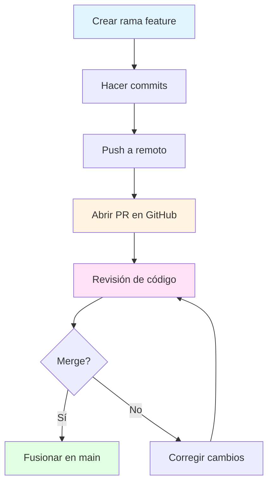
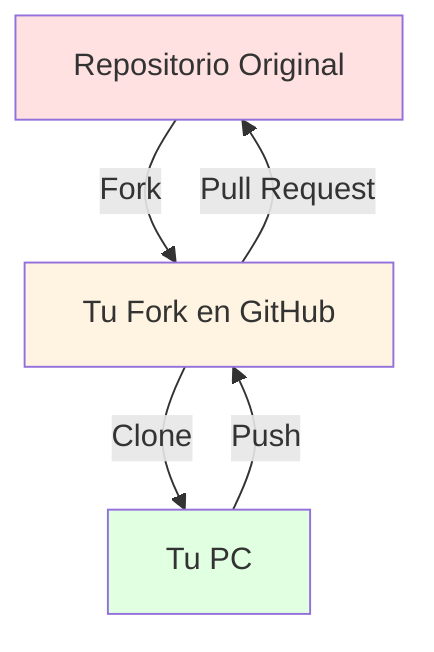

- [4. Colaboración](#4-colaboración)
  - [4.1. Pull Requests (PR)](#41-pull-requests-pr)
    - [Flujo de una Pull Request](#flujo-de-una-pull-request)
    - [Componentes de una PR](#componentes-de-una-pr)
    - [Crear una PR desde Terminal](#crear-una-pr-desde-terminal)
    - [Buenas Prácticas para PRs](#buenas-prácticas-para-prs)
  - [4.2. Fork (Bifurcación)](#42-fork-bifurcación)
    - [Flujo de Trabajo con Fork](#flujo-de-trabajo-con-fork)
    - [Configurar Fork](#configurar-fork)
    - [Mantener Fork Actualizado](#mantener-fork-actualizado)
    - [Crear PR desde Fork](#crear-pr-desde-fork)
  - [4.3. Code Review (Revisión de Código)](#43-code-review-revisión-de-código)
    - [Beneficios del Code Review](#beneficios-del-code-review)
    - [Proceso de Revisión](#proceso-de-revisión)
    - [Comentarios en Revisiones](#comentarios-en-revisiones)
    - [Ser un Buen Revisor](#ser-un-buen-revisor)
    - [Ser un Buen Autor](#ser-un-buen-autor)
  - [4.4. GitHub Actions (CI/CD)](#44-github-actions-cicd)
    - [Conceptos Básicos](#conceptos-básicos)
    - [Ejemplo: Workflow de Tests](#ejemplo-workflow-de-tests)
    - [Comandos para GitHub CLI](#comandos-para-github-cli)
  - [4.5. Issues y Projects](#45-issues-y-projects)
    - [Issues](#issues)
    - [Projects](#projects)
  - [4.6. Convenciones de Mensajes](#46-convenciones-de-mensajes)
    - [Formato Convencional](#formato-convencional)
    - [Tipos Comunes](#tipos-comunes)
    - [Ejemplos](#ejemplos)
  - [4.7. Resumen de Colaboración](#47-resumen-de-colaboración)


# 4. Colaboración

El trabajo en equipo en Git requiere procesos claros de comunicación, revisión de código y gestión de contribuciones.

## 4.1. Pull Requests (PR)

Una **Pull Request** es una herramienta de comunicación fundamental en el desarrollo colaborativo. Se utiliza para proponer cambios, explicar el trabajo y solicitar revisión antes de fusionar.

> **📝 ¿Por qué se llama "Pull"?** Porque literalmente le pides al proyecto que "tire" (pull) de tus cambios.

### Flujo de una Pull Request



### Componentes de una PR

| Elemento | Descripción | Ejemplo |
|----------|-------------|---------|
| **Título** | Resumen claro del cambio | "Añadida autenticación OAuth2" |
| **Descripción** | Contexto y motivación | "Implementa login con Google..." |
| **Cambios** | Archivos modificados | 3 archivos, +150 líneas |
| **Revisiones** | Comentarios de revisores | "LGTM", "Cambia esto..." |
| **Checks** | Tests automatizados | ✅ CI passing |

### Crear una PR desde Terminal

```bash
# 1. Crear y cambiar a nueva rama
git checkout -b feature/nuevo-login

# 2. Hacer cambios y commits
git add .
git commit -m "feat: añadir función de login"

# 3. Subir al remoto
git push -u origin feature/nuevo-login

# 4. Ir a GitHub y crear PR manualmente
# O usar GitHub CLI:
gh pr create --title "feat: login" --body "Implementación..."
```

### Buenas Prácticas para PRs

- **Revisión Independiente**: Antes de crear una PR, revisa tu propio código
- **PRs pequeñas**: Más fáciles de revisar
- **Títulos descriptivos**: Indicar claramente el propósito
- **Commits claros**: Cada commit debe tener sentido independiente

> 📝 **Plantilla de PR profesional:**
> ```
> ## Descripción
> [Explica qué cambios hiciste y por qué]
>
> ## Tipo de cambio
> - [ ] Corrección de bug
> - [ ] Nueva funcionalidad
> - [ ] Cambio breaking
>
> ## Tests
> - [ ] Tests pasaron localmente
> - [ ] Añadidos nuevos tests
>
> ## Checklist
> - [ ] Mi código sigue las guías de estilo
> - [ ] He revisado mi propio código
> - [ ] He documentado mi código
> ```

## 4.2. Fork (Bifurcación)

Un **Fork** consiste en crear una copia de un repositorio existente en tu propia cuenta de GitHub.

> **💡 Analogía:** Fork es como fotocopiar un libro entero. El libro original sigue intacto, tú tienes tu propia copia.

> 📝 **Uso típico:** Contribuir a proyectos open source sin permisos de escritura.

### Flujo de Trabajo con Fork



### Configurar Fork

```bash
# 1. Clonar tu fork
git clone https://github.com/tu-usuario/fork.git

# 2. Añadir remoto original (upstream)
git remote add upstream https://github.com/original/repo.git

# 3. Ver remotos configurados
git remote -v
# origin    https://github.com/tu-usuario/fork.git (fetch)
# origin    https://github.com/tu-usuario/fork.git (push)
# upstream  https://github.com/original/repo.git (fetch)
# upstream  https://github.com/original/repo.git (push)
```

### Mantener Fork Actualizado

```bash
# Traer cambios del original
git fetch upstream

# Fusionar a tu main
git checkout main
git merge upstream/main

# Subir a tu fork
git push origin main

# Flujo completo recomendado
git checkout main
git fetch upstream
git merge upstream/main
git push origin main
```

### Crear PR desde Fork

```bash
# 1. Crear rama para cambios
git checkout -b mi-contribucion

# 2. Trabajar y commit
git add .
git commit -m "fix: corregir bug"

# 3. Subir a tu fork
git push origin mi-contribucion

# 4. Ir a GitHub y crear PR
# Seleccionar: head fork = tu-fork, base fork = original
```

## 4.3. Code Review (Revisión de Código)

La revisión de código es una práctica donde otros desarrolladores examinan tu código antes de fusionarlo.

### Beneficios del Code Review

- **Calidad**: Detecta errores antes de producción
- **Conocimiento**: Equipos aprenden unos de otros
- **Consistencia**: Mantiene estándares de código
- **Colaboración**: Mejora la comunicación

### Proceso de Revisión

```mermaid
graph LR
    A[Autor sube cambios] --> B[Revisor recibe notificación]
    B --> C[Revisar código]
    C --> D{¿Cambios?}
    D -->|Sí| E[Solicitar cambios]
    E --> F[Autor corrige]
    F --> C
    D -->|No| G[Aprobar]
    G --> H[Fusionar]
    
    style A fill:#e1f5ff
    E fill:#ffe1e1
    G fill:#e1ffe1
```

### Comentarios en Revisiones

| Tipo | Símbolo | Significado |
|------|---------|-------------|
| **Suggestion** | 💡 | Mejora sugerida |
| **Question** | ❓ | Duda o aclaración |
| **Blocking** | 🔴 | Debe resolverse antes de merge |
| **Nitpick** | 📝 | Detalle menor, opcional |
| **Approval** | ✅ | Aprobado |

### Ser un Buen Revisor

- **Ser constructivo**: Enfocado en el código, no en la persona
- **Explicar el "por qué"**: No solo qué cambiar, sino por qué
- **Ser específico**: Señalar líneas exactas
- **Aprobar rápidamente**: Si está bien, no demorar
- **Separar opiniones**: Estilo vs. funcionalidad

### Ser un Buen Autor

- **Pequeñas PRs**: Más fáciles de revisar
- **Descripción clara**: Explicar qué y por qué
- **Contextualizar**: Añadir capturas o enlaces
- **Responder**: No tomar críticas como personales
- **Auto-revisar**: Revisa antes de enviar

## 4.4. GitHub Actions (CI/CD)

GitHub Actions permite automatizar workflows directamente en GitHub.

### Conceptos Básicos

```mermaid
graph TB
    A[Evento] --> B[Trigger Workflow]
    B --> C[Job 1: Test]
    B --> D[Job 2: Build]
    C --> E[Success/Fail]
    D --> E
    E --> F[Deploy]
    
    style B fill:#e1f5ff
    C fill:#fff4e1
    D fill:#fff4e1
    F fill:#e1ffe1
```

### Ejemplo: Workflow de Tests

```yaml
# .github/workflows/tests.yml
name: Tests

on:
  push:
    branches: [main]
  pull_request:
    branches: [main]

jobs:
  test:
    runs-on: ubuntu-latest
    
    steps:
    - uses: actions/checkout@v3
    
    - name: Setup .NET
      uses: actions/setup-dotnet@v3
      with:
        dotnet-version: '8.0.x'
    
    - name: Restore dependencies
      run: dotnet restore
    
    - name: Build
      run: dotnet build --no-restore
    
    - name: Test
      run: dotnet test --no-build --verbosity normal
```

### Comandos para GitHub CLI

```bash
# Instalar GitHub CLI
# https://cli.github.com/

# Ver workflows
gh workflow list

# Ver runs de workflows
gh run list

# Ver logs de un run
gh run view [run-id] --log

# Re-ejecutar workflow
gh run re-run [run-id]
```

## 4.5. Issues y Projects

### Issues

Los **issues** son para rastrear tareas, bugs y mejoras.

```bash
# Crear issue con GitHub CLI
gh issue create --title "Bug en login" --body "Descripción..."

# Listar issues
gh issue list

# Ver issue específico
gh issue view [issue-number]
```

### Projects

**GitHub Projects** es un tablero kanban para gestionar trabajo.

- Crear proyectos con tableros
- Añadir issues y PRs como cards
- Organizar en columnas (To Do, In Progress, Done)
- Asignar a miembros del equipo

## 4.6. Convenciones de Mensajes

### Formato Convencional

```
<tipo>(<ámbito>): <descripción>

[cuerpo opcional]

[pie opcional]
```

### Tipos Comunes

| Tipo | Descripción | Ejemplo |
|------|-------------|---------|
| **feat** | Nueva funcionalidad | `feat(auth): add login` |
| **fix** | Corrección de bug | `fix(api): resolve 500 error` |
| **docs** | Solo documentación | `docs: update README` |
| **style** | Formato, sin cambio de código | `style: format code` |
| **refactor** | Reestructuración | `refactor: simplify logic` |
| **test** | Añadir tests | `test: add unit tests` |
| **chore** | Tareas de mantenimiento | `chore: update deps` |

### Ejemplos

```bash
# ❌ Malos mensajes
git commit -m "fix"
git commit -m "cambios"
git commit -m "wip"

# ✅ Buenos mensajes
git commit -m "feat(user): add email verification"
git commit -m "fix(auth): resolve token refresh bug"
git commit -m "docs(api): add endpoint documentation"
```

## 4.7. Resumen de Colaboración

```bash
# Pull Request
git checkout -b feature/nova
git push -u origin feature/nova
# → Ir a GitHub y crear PR

# Fork
git remote add upstream original-repo-url
git fetch upstream
git merge upstream/main

# GitHub CLI
gh pr create              # Crear PR
gh pr list                # Listar PRs
gh pr checkout [PR]       # Cambiar a rama de PR
gh issue create           # Crear issue
gh run list               # Ver workflows
```
