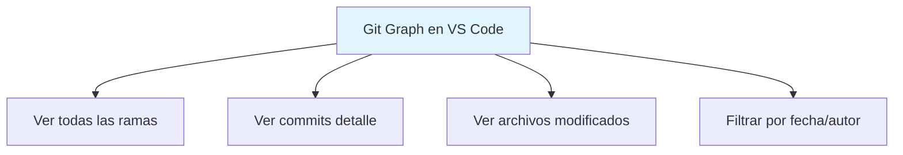

- [5. Herramientas y Recursos](#5-herramientas-y-recursos)
  - [5.1. Clientes Gráficos (GUI)](#51-clientes-gráficos-gui)
    - [GitKraken](#gitkraken)
    - [GitHub Desktop](#github-desktop)
    - [Sourcetree](#sourcetree)
    - [VS Code + Git](#vs-code--git)
    - [Comparativa de GUIs](#comparativa-de-guis)
  - [5.2. Extensiones VS Code para Git](#52-extensiones-vs-code-para-git)
    - [GitLens](#gitlens)
    - [Git Graph](#git-graph)
    - [Otras Extensiones Útiles](#otras-extensiones-útiles)
  - [5.3. GitHub CLI](#53-github-cli)
    - [Instalación](#instalación)
    - [Comandos Principales](#comandos-principales)
    - [Ejemplo Flujo Completo](#ejemplo-flujo-completo)
  - [5.4. Recursos de Aprendizaje](#54-recursos-de-aprendizaje)
    - [Tutoriales Interactivos](#tutoriales-interactivos)
    - [Documentación Oficial](#documentación-oficial)
    - [Cheat Sheets](#cheat-sheets)
    - [Juegos y Gamificación](#juegos-y-gamificación)
  - [5.5. Configuración Avanzada](#55-configuración-avanzada)
    - [Alias Útiles](#alias-útiles)
    - [Usar Alias](#usar-alias)
    - [Colores y Formato](#colores-y-formato)
    - [.gitconfig Completo](#gitconfig-completo)
  - [5.6. Errores Comunes y Soluciones](#56-errores-comunes-y-soluciones)
    - [❌ Errores Típicos](#-errores-típicos)
    - [⚠️ Recuperación de Errores](#️-recuperación-de-errores)
    - [🆘 Comandos de Emergencia](#-comandos-de-emergencia)


# 5. Herramientas y Recursos

## 5.1. Clientes Gráficos (GUI)

Los clientes gráficos facilitan el uso de Git para quienes prefieren interfaces visuales.

### GitKraken

| Característica | Descripción |
|----------------|-------------|
| **Plataforma** | Windows, Mac, Linux |
| **Licencia** | Freemium (gratis para uso personal) |
| **Puntos fuertes** | Mejor GUI, integra GitFlow, aprendizaje visual |
| **Integración** | GitHub, GitLab, Bitbucket, Enterprise |

> 💡 **Ideal para:** Principiantes que quieren entender visualmente cómo funciona Git.

### GitHub Desktop

| Característica | Descripción |
|----------------|-------------|
| **Plataforma** | Windows, Mac |
| **Licencia** | Gratis |
| **Puntos fuertes** | Integración nativa GitHub, simple |
| **Limitaciones** | Solo GitHub, menos features |

### Sourcetree

| Característica | Descripción |
|----------------|-------------|
| **Plataforma** | Windows, Mac |
| **Licencia** | Gratis |
| **Puntos fuertes** | Completo, gratuito |
| **Puntos débiles** | Interfaz anticuada |

### VS Code + Git

| Característica | Descripción |
|----------------|-------------|
| **Plataforma** | Multiplataforma |
| **Licencia** | Gratis |
| **Puntos fuertes** | Ligero, integración nativa, extensible |

```bash
# Comandos Git desde terminal integrado en VS Code
# Ctrl+` para abrir terminal
# Clic en icono Git en barra lateral
```

### Comparativa de GUIs

| Herramienta | Facilidad | Features | Integración | Precio |
|-------------|-----------|----------|-------------|--------|
| GitKraken | ⭐⭐⭐⭐⭐ | ⭐⭐⭐⭐⭐ | ⭐⭐⭐⭐⭐ | Freemium |
| GitHub Desktop | ⭐⭐⭐⭐⭐ | ⭐⭐⭐ | ⭐⭐⭐⭐⭐ | Gratis |
| Sourcetree | ⭐⭐⭐ | ⭐⭐⭐⭐ | ⭐⭐⭐ | Gratis |
| VS Code + Git | ⭐⭐⭐⭐ | ⭐⭐⭐⭐ | ⭐⭐⭐⭐ | Gratis |

## 5.2. Extensiones VS Code para Git

### GitLens

| Característica | Descripción |
|----------------|-------------|
| **Función** | Ver blame, historial, comparar commits |
| **Atajo** | `Alt+` para blame rápido |

**Features principales:**
- Blame en línea
- Historial de archivos
- Comparar commits
- Buscar en historial
- Visualizar ramas

### Git Graph

| Característica | Descripción |
|----------------|-------------|
| **Función** | Visualizar historial como grafo |



### Otras Extensiones Útiles

| Extensión | Función |
|-----------|---------|
| **Gitmoji** | Usar emojis en commits |
| **Git History** | Ver historial detallado de archivos |
| **GitLab Workflow** | Integración GitLab |
| **GitHub Pull Requests** | Gestionar PRs desde VS Code |
| **Remote Repositories** | Editar repositorios remotos directamente |

## 5.3. GitHub CLI

**GitHub CLI** (`gh`) permite gestionar GitHub desde la terminal.

### Instalación

```bash
# Windows (scoop)
scoop install gh

# Windows (chocolatey)
choco install gh

# macOS
brew install gh

# Linux
# https://github.com/cli/cli/blob/trunk/docs/install_linux.md
```

### Comandos Principales

```bash
# Autenticarse
gh auth login

# Ver estado de autenticación
gh auth status

# Pull Requests
gh pr list                    # Listar PRs
gh pr view [PR]               # Ver PR
gh pr create                  # Crear PR
gh pr checkout [PR]           # Cambiar a rama de PR
gh pr merge [PR]              # Fusionar PR
gh pr review [PR]             # Revisar PR

# Issues
gh issue list                 # Listar issues
gh issue view [issue]         # Ver issue
gh issue create               # Crear issue
gh issue close [issue]        # Cerrar issue

# Releases
gh release list               # Listar releases
gh release create             # Crear release

# Gist
gh gist list                  # Listar gists
gh gist create                # Crear gist

# Repository
gh repo view                  # Ver repo
gh repo clone [repo]          # Clonar repo
gh repo fork [repo]           # Fork repo
```

### Ejemplo Flujo Completo

```bash
# Clonar repo
gh repo clone usuario/repo

# Crear rama
git checkout -b feature/nueva

# Trabajar y commit
git add .
git commit -m "feat: nueva funcionalidad"

# Subir y crear PR
git push -u origin feature/nueva
gh pr create --title "feat: nueva funcionalidad" --body "Descripción..."

# Ver estado de PR
gh pr view

# Aprobar PR (como revisor)
gh pr review --approve

# Fusionar PR
gh pr merge --merge
```

## 5.4. Recursos de Aprendizaje

### Tutoriales Interactivos

| Recurso | Descripción | Nivel |
|---------|-------------|-------|
| [Learn Git Branching](https://learngitbranching.js.org) | Tutorial interactivo visual | Principiante |
| [Git Immersion](https://gitimmersion.com) | Tutorial paso a paso | Principiante |
| [GitKatas](https://github.com/praqma-training/git-katas) | Ejercicios prácticos | Todos |
| [GitHub Learning Lab](https://lab.github.com) | Cursos de GitHub | Principiante |

### Documentación Oficial

| Recurso | Descripción |
|---------|-------------|
| [Git Documentation](https://git-scm.com/doc) | Documentación oficial |
| [Git Pro Book](https://git-scm.com/book/es/v2) | Libro completo de Git |
| [GitHub Docs](https://docs.github.com) | Documentación GitHub |
| [GitLab Docs](https://docs.gitlab.com) | Documentación GitLab |

### Cheat Sheets

| Recurso | Descripción |
|---------|-------------|
| [Git Cheat Sheet](https://education.github.com/git-cheat-sheet-education.pdf) | Sheet oficial de GitHub |
| [Git Cheatsheet](https://ndpsoftware.com/git-cheatsheet.html) | Visual interactivo |
| [Git Command Explorer](https://git-cheatsheet.com) | Búsqueda por comando |

### Juegos y Gamificación

| Recurso | Descripción |
|---------|-------------|
| [Oh My Git!](https://ohmygit.org) | Juego para aprender Git |
| [Git Tower Game](https://www.git-tower.com/learn/git/commands/game) | Juego de comandos |
| [Learning Git with Jupyter](https://github.com/jupyterlab/jupyterlab-git) | Git en Jupyter |

## 5.5. Configuración Avanzada

### Alias Útiles

```bash
# Alias de configuración
git config --global alias.st status
git config --global alias.co checkout
git config --global alias.br branch
git config --global alias.ci commit
git config --global alias.df diff
git config --global alias.lg "log --oneline --graph --all"

# Alias avanzados
git config --global alias.last "log -1 HEAD"
git config --global alias.unstage "reset HEAD --"
git config --global alias.visual "!gitk"
```

### Usar Alias

```bash
# En lugar de:
git status
git checkout main
git log --oneline --graph --all

# Se puede usar:
git st
git co main
git lg
```

### Colores y Formato

```bash
# Activar colores
git config --global color.ui auto

# Colores específicos
git config --global color.branch.current "green reverse"
git config --global color.branch.local "green"
git config --global color.branch.remote "red"

# Formato de log
git config --global format.pretty "%h %s %cn"
```

### .gitconfig Completo

```ini
[user]
    name = Tu Nombre
    email = tu.email@ejemplo.com

[core]
    editor = code --wait
    autocrlf = input
    safecrlf = warn

[alias]
    st = status
    co = checkout
    br = branch
    ci = commit
    df = diff
    lg = log --oneline --graph --all
    last = log -1 HEAD
    unstage = reset HEAD --

[color]
    ui = auto
    branch = auto
    diff = auto
    status = auto

[merge]
    tool = vscode
    conflictstyle = diff3

[difftool "vscode"]
    cmd = code --wait --diff $LOCAL $REMOTE

[pull]
    rebase = false

[push]
    default = simple
```

## 5.6. Errores Comunes y Soluciones

### ❌ Errores Típicos

| Error | Causa | Solución |
|-------|-------|----------|
| "fatal: not a git repository" | No estás en un repo Git | `git init` o `git clone` |
| "nothing to commit, working tree clean" | No hay cambios | Modifica archivos |
| "changes not staged for commit" | Cambios sin preparar | `git add` |
| "commit nothing to commit" | Todo ya commiteado | Crea nueva rama |
| "failed to push some refs" | El remoto tiene cambios nuevos | `git pull` primero |
| "merge conflict" | Dos personas modificaron lo mismo | Resolver conflictos |
| "detached HEAD" | Checkout a commit, no rama | `git checkout rama` |

### ⚠️ Recuperación de Errores

```bash
# Recuperar cambios después de reset --hard
git reflog                    # Ver historial
git reset --hard HEAD@{n}     # Restaurar

# Recuperar archivo eliminado
git checkout -- archivo.txt

# Recuperar commit eliminado
git reflog
git cherry-pick [commit-hash]

# Deshacer último commit (soft)
git reset --soft HEAD~1

# Ver qué commit eliminó algo
git log --all --full-history -- archivo.txt
```

### 🆘 Comandos de Emergencia

```bash
# Ver todo el historial (incluido resets)
git reflog

# Buscar commit por mensaje
git log --all --grep="mensaje"

# Buscar commit que改性ó una línea
git log -S "texto buscadp"

# Recuperar archivo de cualquier commit
git checkout [commit-hash] -- archivo.txt

# Ver todos los commits de todas las ramas
git log --all --oneline --graph

# Encontrar "perdido" commit
git fsck --lost-found
```
