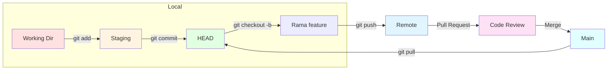
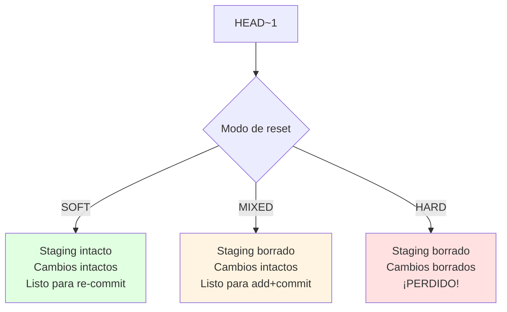
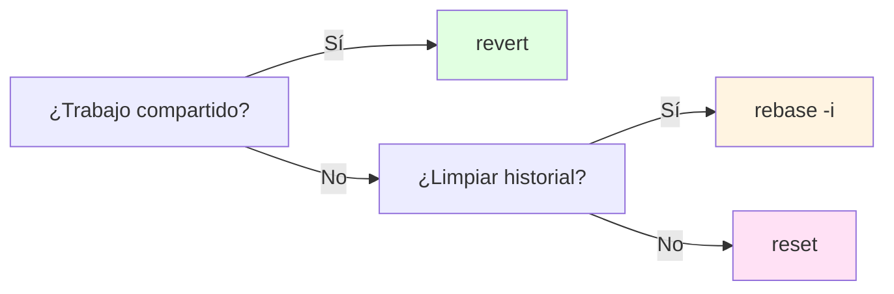

- [6. Resumen y Conclusiones](#6-resumen-y-conclusiones)
  - [6.1. Mapa Conceptual de la Unidad](#61-mapa-conceptual-de-la-unidad)
  - [6.2. Resumen por Temas](#62-resumen-por-temas)
    - [Git Inicial](#git-inicial)
    - [Git Avanzado](#git-avanzado)
    - [Git Remoto](#git-remoto)
    - [Colaboración](#colaboración)
  - [6.3. Flujo de Trabajo Completo](#63-flujo-de-trabajo-completo)
  - [6.4. Comparativa de Flujos](#64-comparativa-de-flujos)
  - [6.5. Comandos Esenciales por Categoría](#65-comandos-esenciales-por-categoría)
    - [Configuración](#configuración)
    - [Inicio](#inicio)
    - [Básico](#básico)
    - [Deshacer](#deshacer)
    - [Ramas](#ramas)
    - [Merge y Rebase](#merge-y-rebase)
    - [Cherry-Pick (¡Mi comando favorito!)](#cherry-pick-mi-comando-favorito)
    - [Deshacer: La Guía Definitiva](#deshacer-la-guía-definitiva)
    - [Modos de Reset: Diferencias](#modos-de-reset-diferencias)
    - [Reset vs Revert vs Rebase](#reset-vs-revert-vs-rebase)
    - [Trucos: Eliminar el Último Commit](#trucos-eliminar-el-último-commit)
    - [Recuperar un Commit "Eliminado"](#recuperar-un-commit-eliminado)
    - [Modificar el Último Commit](#modificar-el-último-commit)
    - [Remotos](#remotos)
    - [Colaboración](#colaboración-1)
  - [6.6. Checklist de Supervivencia](#66-checklist-de-supervivencia)
    - [Git Inicial](#git-inicial-1)
    - [Git Avanzado](#git-avanzado-1)
    - [Git Remoto](#git-remoto-1)
    - [Colaboración](#colaboración-2)
    - [Herramientas](#herramientas)
  - [6.7. Atajos de Git más Usados](#67-atajos-de-git-más-usados)
  - [6.8. Errores Comunes y Soluciones](#68-errores-comunes-y-soluciones)
  - [6.9. Recursos Adicionales](#69-recursos-adicionales)
    - [Documentación](#documentación)
    - [Tutoriales Interactivos](#tutoriales-interactivos)
    - [Cheat Sheets](#cheat-sheets)
  - [6.10. Checklist de Supervivencia](#610-checklist-de-supervivencia)
    - [Git Inicial](#git-inicial-2)
    - [Git Avanzado](#git-avanzado-2)
    - [Git Remoto](#git-remoto-2)
    - [Colaboración](#colaboración-3)
    - [Herramientas](#herramientas-1)


# 6. Resumen y Conclusiones


El control de versiones con Git es una habilidad fundamental para cualquier desarrollador. Dominar los conceptos básicos de commits, ramas y remotos te permitirá:

- **Trabajar en equipo** sin conflictos
- **Mantener un historial** de tu código
- **Experimentar** con nuevas funcionalidades de forma segura
- **Recuperar** versiones anteriores si algo sale mal

> 💡 **Consejo final:** La práctica es clave. Crea un repositorio personal y experimenta con todos los comandos. Los errores son la mejor forma de aprender.


## 6.1. Mapa Conceptual de la Unidad

```mermaid
graph TD
    UD03[UD03: Control de Versiones] --> GINI[Git Inicial]
    UD03 --> GAV[Git Avanzado]
    UD03 --> GRE[Git Remoto]
    UD03 --> COL[Colaboración]
    UD03 --> HERR[Herramientas]

    GINI --> GINI1[Conceptos básicos]
    GINI --> GINI2[Ciclo de vida]
    GINI --> GINI3[Comandos esenciales]
    GINI --> GINI4[Estados de archivos]
    GINI --> GINI5[Deshacer cambios]
    GINI --> GINI6[Stash y Tags]

    GAV --> GAV1[Ramas]
    GAV --> GAV2[Merge]
    GAV --> GAV3[Cherry-Pick]
    GAV --> GAV4[Rebase]
    GAV --> GAV5[Conflictos]
    GAV --> GAV6[GitHub Flow]
    GAV --> GAV7[GitFlow]

    GRE --> GRE1[GitHub]
    GRE --> GRE2[Remote]
    GRE --> GRE3[Push/Pull/Fetch]
    GRE --> GRE4[Tags y versiones]
    GRE --> GRE5[SSH Keys]

    COL --> COL1[Pull Requests]
    COL --> COL2[Fork]
    COL --> COL3[Code Review]
    COL --> COL4[GitHub Actions]
    COL --> COL5[Conventional Commits]

    HERR --> HERR1[GUIs]
    HERR --> HERR2[VS Code]
    HERR --> HERR3[GitHub CLI]
    HERR --> HERR4[Recursos]
    HERR --> HERR5[Errores comunes]

    style UD03 fill:#e1f5ff
    style GINI fill:#e1ffe1
    style GAV fill:#fff4e1
    style GRE fill:#ffe1f5
    style COL fill:#ffffe1
    style HERR fill:#ffe1e1
```



## 6.2. Resumen por Temas

### Git Inicial

| Concepto | Descripción |
|----------|-------------|
| **Repositorio** | Base de datos con todo el historial |
| **Commit** | Instantánea con hash SHA-1 |
| **Staging Area** | Zona intermedia antes del commit |
| **Working Directory** | Copia local donde trabajas |
| **HEAD** | Puntero al commit actual |

### Git Avanzado

| Concepto | Descripción |
|----------|-------------|
| **Rama** | Línea de desarrollo independiente |
| **Merge** | Fusionar cambios de ramas |
| **Rebase** | Reaplicar commits sobre otra base |
| **Conflicto** | Dos修改aron las mismas líneas |
| **GitHub Flow** | Flujo simple con main + features |
| **GitFlow** | Flujo estructurado con develop/release/hotfix |

### Git Remoto

| Concepto | Descripción |
|----------|-------------|
| **Origin** | Nombre del remoto por defecto |
| **Push** | Subir commits al remoto |
| **Pull** | Traer y fusionar del remoto |
| **Fetch** | Traer sin fusionar |
| **Tag** | Marca de versión (v1.0.0) |

### Colaboración

| Concepto | Descripción |
|----------|-------------|
| **Pull Request** | Solicitud de incorporar cambios |
| **Fork** | Copia de un repositorio ajeno |
| **Code Review** | Revisión de código por pares |
| **GitHub Actions** | CI/CD automatizado |

## 6.3. Flujo de Trabajo Completo



## 6.4. Comparativa de Flujos

| Aspecto | GitHub Flow | GitFlow |
|---------|-------------|---------|
| **Ramas principales** | Solo `main` | `main` + `develop` |
| **Release branches** | No | Sí |
| **Hotfixes** | Desde main | Desde main/master |
| **Complejidad** | Baja | Alta |
| **Ideal para** | Web apps CD | Software con versiones |

## 6.5. Comandos Esenciales por Categoría

### Configuración

```bash
git config --global user.name "Tu Nombre"
git config --global user.email "tu@email.com"
git config --global core.editor "code --wait"
```

### Inicio

```bash
git init                          # Nuevo repositorio
git clone url                     # Clonar existente
```

### Básico

```bash
git status                        # Ver estado
git add .                         # Preparar cambios
git commit -m "msg"               # Guardar cambios
git log --oneline                 # Ver historial
```

### Deshacer

```bash
git restore archivo               # Deshacer cambios locales
git restore --staged archivo      # Quitar del staging
git revert HEAD                   # Revertir último commit (seguro)
git reset --soft HEAD~1           # Eliminar commit, conservar cambios
git reset --mixed HEAD~1          # Eliminar commit y staging
git reset --hard HEAD~1           # ¡TODO BORRADO! (peligroso)
git cherry-pick [hash]            # Aplicar commit específico
```

### Ramas

```bash
git branch                        # Listar ramas
git checkout -b rama              # Crear y cambiar
git switch rama                   # Cambiar rama
git branch -d rama                # Eliminar rama
```

### Merge y Rebase

```bash
git merge rama                    # Fusionar rama
git rebase main                   # Rebase sobre main
git merge --abort                 # Cancelar merge
git rebase --abort                # Cancelar rebase
```

### Cherry-Pick (¡Mi comando favorito!)

```bash
# Aplicar un commit específico a la rama actual
git cherry-pick [commit-hash]

# Aplicar varios commits
git cherry-pick hash1 hash2 hash3

# Cherry-pick con rango de commits
git cherry-pick hash1..hash5

# Cherry-pick sin hacer commit (solo preparar)
git cherry-pick -n [commit-hash]

# Cherry-pick desde otra rama
git checkout main
git cherry-pick develop~3
```

> 💡 **¿Cuándo usar cherry-pick?** Cuando quieres aplicar un commit específico de otra rama sin fusionar toda la rama. Ejemplo: aplicar un hotfix a main sin mergear toda la feature branch.

### Deshacer: La Guía Definitiva

| Comando | ¿Qué hace? | ¿Historial? | ¿Seguro compartido? |
|---------|------------|-------------|---------------------|
| `git restore archivo` | Descarta cambios locales | ❌ No | ✅ Sí |
| `git restore --staged archivo` | Quita del staging | ❌ No | ✅ Sí |
| `git revert HEAD` | Crea commit que deshace | ✅ SÍ | ✅ Sí |
| `git reset --soft HEAD~1` | Deshace commit, mantiene cambios | ❌ No | ❌ No |
| `git reset --mixed HEAD~1` | Deshace commit y staging | ❌ No | ❌ No |
| `git reset --hard HEAD~1` | **¡TODO fuera!** | ❌ No | ❌ No |

### Modos de Reset: Diferencias



```bash
# SOFT: Solo mueve HEAD, mantiene todo
git reset --soft HEAD~1
# Resultado: Commit deshecho, cambios en staging

# MIXED (por defecto): Deshace commit y staging
git reset HEAD~1
# Resultado: Commit deshecho, cambios sin staged

# HARD: ¡TODO BORRADO!
git reset --hard HEAD~1
# Resultado: Commit deshecho, cambios borrados
# ⚠️ ¡PELIGRO! Los cambios se pierden para siempre
```

> ⚠️ **ADVERTENCIA:** `git reset --hard` es irreversible. Los cambios se borran del disco. Solo usar si estás completamente seguro.

### Reset vs Revert vs Rebase

| Comando | Propósito | Historial | Uso típico |
|---------|-----------|-----------|------------|
| **reset** | Volver atrás | Modifica | Trabajo local |
| **revert** | Invertir commit | Conserva | Trabajo compartido |
| **rebase** | Mover/reescribir | Modifica | Limpiar historial |



### Trucos: Eliminar el Último Commit

```bash
# OPCIÓN 1: Conservar los cambios (recomendado)
git reset --soft HEAD~1
# El commit se elimina pero los cambios vuelven al staging

# OPCIÓN 2: Conservar cambios sin staging
git reset HEAD~1
# El commit se elimina, cambios quedan sin stagiar

# OPCIÓN 3: ¡BORRAR TODO! (peligroso)
git reset --hard HEAD~1
# Todo desaparece. No hay vuelta atrás.

# OPCIÓN 4: Usar revert (seguro para compartidos)
git revert HEAD
# Crea un nuevo commit que deshace el anterior
```

### Recuperar un Commit "Eliminado"

```bash
# Ver todo el historial de HEAD (incluye resets)
git reflog

# Buscar el commit perdido
git reflog | grep commit

# Restaurar el commit encontrado
git checkout [commit-hash]
# O
git reset --hard [commit-hash]
```

> 💡 **Truco profesional:** `git reflog` es tu salvavidas. Guarda todos los movimientos de HEAD, incluso después de un `reset --hard`. Úsalo para recuperar commits "perdidos".

### Modificar el Último Commit

```bash
# Cambiar el mensaje del último commit
git commit --amend -m "Nuevo mensaje"

# Añadir archivos olvidados al último commit
git add archivo-olvidado.txt
git commit --amend --no-edit

# Cambiar autor del último commit
git commit --amend --author="Nuevo Autor <email@ej.com>"
```

### Remotos

```bash
git remote -v                     # Ver remotos
git push origin main              # Subir cambios
git pull origin main              # Bajar y fusionar
git fetch origin                  # Traer sin fusionar
git push --tags                   # Subir etiquetas
```

### Colaboración

```bash
git checkout -b feature/nova      # Crear rama feature
git push -u origin feature/nova   # Subir y crear tracking
git remote add upstream url       # Añadir fork original
git fetch upstream                # Actualizar fork
```

## 6.6. Checklist de Supervivencia

Antes de dar por cerrado el tema, asegúrate de poder responder **SÍ**:

### Git Inicial
- [ ] ¿Entiendo la diferencia entre Git y GitHub?
- [ ] ¿Puedo configurar Git con mi nombre y email?
- [ ] ¿Sé usar `git add`, `git commit` y `git status`?
- [ ] ¿Entiendo el concepto de área de staging?
- [ ] ¿Puedo configurar `.gitignore` correctamente?

### Git Avanzado
- [ ] ¿Puedo crear, cambiar y eliminar ramas?
- [ ] ¿Sé resolver un merge básico?
- [ ] ¿Conozco la diferencia entre `reset` y `revert`?
- [ ] ¿Entiendo qué es un conflicto y cómo resolverlo?
- [ ] ¿Conozco GitHub Flow y GitFlow?

### Git Remoto
- [ ] ¿Puedo usar `git push` y `git pull`?
- [ ] ¿Sé la diferencia entre `fetch` y `pull`?
- [ ] ¿Puedo crear y subir tags?

### Colaboración
- [ ] ¿Entiendo qué es una Pull Request?
- [ ] ¿Sé la diferencia entre Fork y Clone?
- [ ] ¿Conozco el proceso de code review?

### Herramientas
- [ ] ¿Puedo usar un cliente GUI básico?
- [ ] ¿Sé usar recursos online para consultar comandos?

## 6.7. Atajos de Git más Usados

| Atajo | Descripción |
|-------|-------------|
| `git status` | Ver estado actual |
| `git add .` | Preparar todos los cambios |
| `git commit -m "msg"` | Commit con mensaje |
| `git push origin main` | Subir cambios |
| `git pull` | Bajar y fusionar |
| `git checkout -b rama` | Crear y cambiar a rama |
| `git log --oneline` | Ver historial resumido |
| `git diff` | Ver cambios no preparados |
| `git branch` | Listar ramas |
| `git merge rama` | Fusionar rama |

## 6.8. Errores Comunes y Soluciones

| Error | Causa | Solución |
|-------|-------|----------|
| "not a git repository" | No estás en un repo | `git init` o `git clone` |
| "nothing to commit" | No hay cambios | Modifica archivos |
| "changes not staged" | Cambios sin preparar | `git add` |
| "failed to push" | El remoto tiene cambios nuevos | `git pull` primero |
| "merge conflict" | Dos修改aron lo mismo | Resolver conflictos |
| "detached HEAD" | Checkout a commit | `git checkout rama` |

## 6.9. Recursos Adicionales

### Documentación
- [Git Documentation](https://git-scm.com/doc)
- [GitHub Docs](https://docs.github.com)

### Tutoriales Interactivos
- [Learn Git Branching](https://learngitbranching.js.org)
- [Git Immersion](https://gitimmersion.com)

### Cheat Sheets
- [Git Cheat Sheet](https://education.github.com/git-cheat-sheet-education.pdf)
- [Git Command Explorer](https://git-cheatsheet.com)


## 6.10. Checklist de Supervivencia

Antes de dar por cerrado el tema, asegúrate de poder responder **SÍ** a estas preguntas:

### Git Inicial
- [ ] ¿Entiendo la diferencia entre Git (local) y GitHub (remoto)?
- [ ] ¿Puedo configurar Git con mi nombre y email?
- [ ] ¿Sé usar `git add`, `git commit` y `git status` correctamente?
- [ ] ¿Entiendo el concepto de área de staging?
- [ ] ¿Puedo configurar `.gitignore` correctamente?

### Git Avanzado
- [ ] ¿Puedo crear, cambiar y eliminar ramas?
- [ ] ¿Sé resolver un merge básico?
- [ ] ¿Conozco la diferencia entre `git reset` y `git revert`?
- [ ] ¿Entiendo qué es un conflicto y cómo resolverlo?
- [ ] ¿Conozco al menos un flujo de trabajo (GitHub Flow o GitFlow)?

### Git Remoto
- [ ] ¿Puedo usar `git push` y `git pull` con un remoto?
- [ ] ¿Sé la diferencia entre `git fetch` y `git pull`?
- [ ] ¿Puedo crear y subir tags?

### Colaboración
- [ ] ¿Entiendo qué es una Pull Request y cómo crearla?
- [ ] ¿Sé la diferencia entre Fork y Clone?
- [ ] ¿Conozco el proceso de code review?

### Herramientas
- [ ] ¿Puedo usar un cliente GUI básico?
- [ ] ¿Sé usar un recurso online para consultar comandos?
